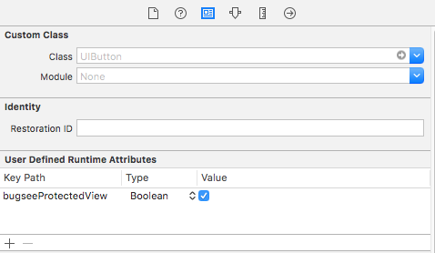

import Tabs from '@theme/Tabs';
import TabItem from '@theme/TabItem';

## Disabling video

Video recording can be disabled completely using **BugseeVideoEnabledKey** launch option. See [configuration](/sdk/ios/configuration/) for more info.

## Protecting views

All system text boxes that are marked as secure are hidden from the recorded video automatically. In addition we support a way to mark your custom sensitive views so they will be treated similarly.


### Marking view as protected in code

You can protect any view that you want by importing ```Bugsee.h``` header and implement the following code:


<Tabs groupId="lang-ios">
  <TabItem value="objective-c" label="Objective-C">

```objectivec
self.myView.bugseeProtectedView = YES;
```

  </TabItem>
  <TabItem value="swift" label="Swift">

```swift
self.myView.bugseeProtectedView = YES
```

  </TabItem>
</Tabs>

### Marking view as protected in storyboard


- Open storyboard or xib file with interface
- Select view that you need to protect
- Choose the Identity inspector tab on right panel(3rd tab)
- Add a User Defined Runtime Attribute called *bugseeProtectedView* as shown in the picture.

### Protected web page elements
You can also prevent any web page element, shown in WebView, from being recorded by adding class="bugsee-hide" to it.

```html
<input type="text" class="bugsee-hide">
```

Elements with type="password" are not recorded by default. If you want such web page element to be recorded, add class="bugsee-show" to it.

```html
<input type="password" class="bugsee-show">
```

### Protecting by coordinates

Bugsee allows hiding screen area by absolute coordinates as well:

CGRect you make must be in points, with 0,0 coordinates in top left corner.


<Tabs groupId="lang-ios">
  <TabItem value="objective-c" label="Objective-C">

```objectivec
[Bugsee addSecureRect:CGRectMake(10, 10, 100, 100)];
```

  </TabItem>
  <TabItem value="swift" label="Swift">

```swift
Bugsee.addSecureRect(CGRect(x: 10, y: 10, width: 100, height: 100))
```

  </TabItem>
</Tabs>

You need to be aware of the orientation that can be changed during application work.
Recreate Rect after orientation change, if 'black box' on video does not cover all secure data that you need.

Other methods of secure rectangles


<Tabs groupId="lang-ios">
  <TabItem value="objective-c" label="Objective-C">

```objectivec
// Remove rect
[Bugsee removeSecureRect:CGRectMake(10, 10, 100, 100)];

// Get all rectangles
NSArray * rectangles = [Bugsee getAllSecureRects];
for (NSValue * rectValue in rectangles){
    CGRect rect = [rectValue CGRectValue];
}

// Remove all rectangles
[Bugsee removeAllSecureRects];
```

  </TabItem>
  <TabItem value="swift" label="Swift">

```swift
// Remove rect
Bugsee.removeSecureRect(CGRect(x: 10, y: 10, width: 100, height: 100))

// Get all rectangles
let rectangles = Bugsee.getAllSecureRects();
for rectValue in rectangles!{
    var rect = (rectValue as! NSValue).cgRectValue
}

// Remove all rectangles
Bugsee.removeAllSecureRects()
```

  </TabItem>
</Tabs>

## Obscuring contents

Sometimes application may contain too many elements with sensitive data. Marking all the views in such app as protected maybe quite overwhelming and time consuming. In these cases you can instruct Bugsee to obscure the whole screen by lowering resolution of the captured video. In this case, you won't be able to see the text on the screen, but you will be able to follow user navigation.

To achieve this, try setting BugseeVideoScaleKey to a value between 0.1 and 1.0.

## Going dark

In some rare cases you might want to conceal the whole screen and stop recording events completely. The following APIs will come in handy, no data is being gathered between the calls to pause and resume.


<Tabs groupId="lang-ios">
  <TabItem value="objective-c" label="Objective-C">

```objectivec
// To stop video recording use
[Bugsee pause];

// And to continue
[Bugsee resume];
```

  </TabItem>
  <TabItem value="swift" label="Swift">

```swift
// To stop video recording use   
Bugsee.pause()

// And to continue
Bugsee.resume()
```

  </TabItem>
</Tabs>

## Hiding keyboard

In some cases you might want to prevent keyboard to be captured on video (as well as touches). You can use the following method to achieve the desired effect.


<Tabs groupId="lang-ios">
  <TabItem value="objective-c" label="Objective-C">

```objectivec
// To prevent keyboard from being captured
[Bugsee hideKeyboard:true];

// To let us capture keyboard again
[Bugsee hideKeyboard:false];
```

  </TabItem>
  <TabItem value="swift" label="Swift">

```swift
// To prevent keyboard from being captured
Bugsee.hideKeyboard(true)

// To let us capture keyboard again
Bugsee.hideKeyboard(false)
```

  </TabItem>
</Tabs>
