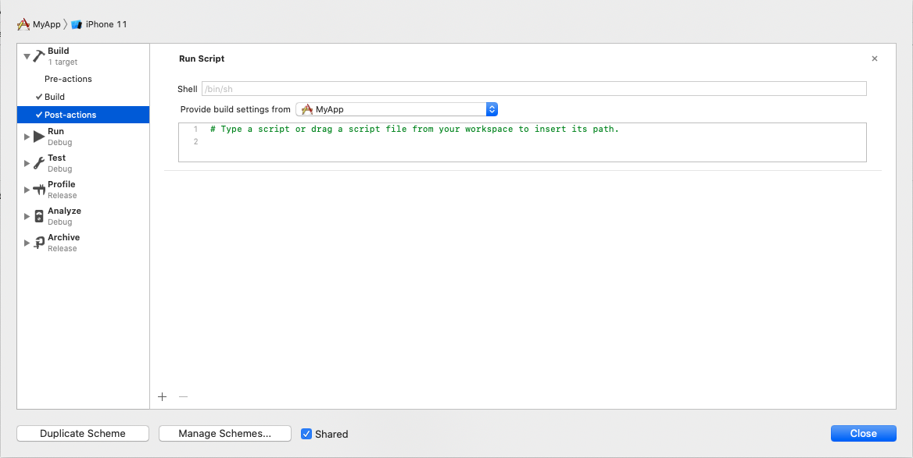
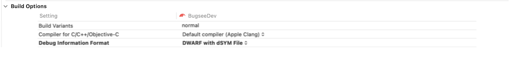
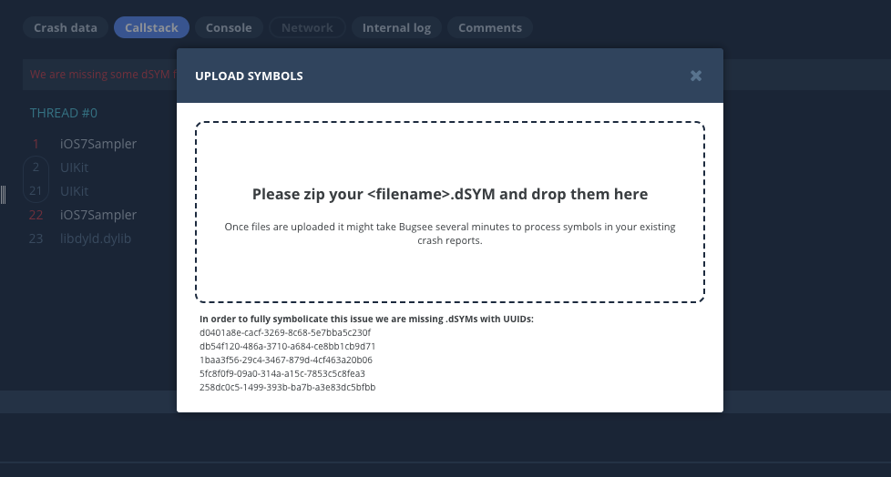

import Tabs from '@theme/Tabs';
import TabItem from '@theme/TabItem';

Bugsee is able to properly process and symbolicate crash reports that are uploaded from your users. Even if your binary has its symbols stripped, Bugsee can often resolve them automatically. In some cases that might be enough to root cause the problem, however best results will be achieved when Bugsee can match a crash report with a symbol file (dSYM) of the crashed build.

Bugsee can automatically upload dSYM files during the build phase. The system is smart enough to match the right dSYM to a crash report.

## Auto dSYM upload

Edit your scheme by going to Product->Scheme->Edit Scheme.

- Add an extra "Run Script" build phase to "Post-actions" stage of your scheme



:::warning
**Don't forget to select proper scheme for *"Provide build settings from"*! Otherwise, script will not be provided with proper inputs and will not be able to collect and upload dSYMs.**
:::

- Paste the following script into it and don't forget to change your_app_token with the one you use for initializing the SDK


<Tabs groupId="install-method">
  <TabItem value="non-spm-installation" label="Non-SPM installation">

```sh
SCRIPT_SRC=$(find "$PROJECT_DIR" -name 'BugseeAgent' | head -1)
if [ ! "${SCRIPT_SRC}" ]; then
    echo "Error: BugseeAgent script not found !!!"
    echo "If you link Bugsee.framework from outside the project folder, please copy the script"
    echo "into your main project directory or manually update SCRIPT_SRC variable with the right path"
    exit 1
fi
python3 "${SCRIPT_SRC}" <your_app_token> >> /tmp/BugseeAgent.txt
```

  </TabItem>
  <TabItem value="spm" label="SPM">

```sh
SCRIPT_SRC="${BUILD_DIR%Build/*}SourcePackages/checkouts/spm/Tools/BugseeAgent"
if [ ! "${SCRIPT_SRC}" ]; then
    echo "Error: BugseeAgent script not found !!!"
    echo "If you link Bugsee.framework from outside the project folder, please copy the script"
    echo "into your main project directory or manually update SCRIPT_SRC variable with the right path"
    exit 1
fi
python3 "${SCRIPT_SRC}" <your_app_token> >> /tmp/BugseeAgent.txt
```

  </TabItem>
</Tabs>

:::warning
Starting with Bugsee iOS SDK 2.1.0 it is required to use Python 3 to run BugseeAgent.
:::

The scripts above find the **BugseeAgent** helper utility. Location may vary: within your project folder for Non-SPM installation, or within Derived Data for SPM installation.
For optimization purposes you can modify the script with the direct link to **BugseeAgent** in your particular folder structure.

:::info
Note that for platforms like React Native, BugseeAgent is located in node_modules directory which is one-level up from the project directory. Don't forget to reflect that in script above by appending "/../" to the $PROJECT_DIR variable.
:::

### Debug builds

You must also make sure that dSYM files are being created in debug configuration as well, as usually that is not the case:



In case you are using CocoaPods frameworks with **use_frameworks!** attribute enabled, you might want to add the following post install hook to the end of your Podfile to make sure dSYM for all
the frameworks are being generated as well:

```ruby
#...end of Podfile...
post_install do |installer|
  installer.pods_project.targets.each do |target|
    target.build_configurations.each do |config|
      config.build_settings['DEBUG_INFORMATION_FORMAT'] = 'dwarf-with-dsym'
    end
  end
end
```

## Build info & Size analysis

:::info[Requires Bugsee iOS SDK 6.1.5 or newer]
The full build-publish flow (build info, size analysis, in-build size check, chunked upload) ships in **6.1.5** ([release notes](/sdk/ios/release-notes#615-may-13-2026)). On older SDKs the post-action only handles dSYM upload and silently ignores the `BUGSEE_BUILD_INFO_*` / `BUGSEE_SIZE_*` env vars described below.
:::

The same `BugseeAgent` script that uploads dSYMs also runs a build-publish flow. Three optional layers, each controlled by environment variables you set in the scheme's "Run Script" post-action (or export in a CI step before invoking `xcodebuild`).

:::tip[Powered by the Bugsee CLI]
This whole flow is the **[Bugsee CLI](/cli/)**'s `xcode post-action` command — `BugseeAgent` shells out to it. The `BUGSEE_*` environment variables below each have a matching CLI flag (a command-line flag wins over its env var), and the same flow can run directly in CI without Xcode. See [iOS build publishing](/cli/xcode/) for the full flag reference.
:::

### Build info — default ON

Every matching build registers a record on Bugsee servers carrying:

- Bundle identifier, marketing version (`CFBundleShortVersionString`), build number (`CFBundleVersion`), `$CONFIGURATION`, format (`ipa`)
- Main executable's Mach-O `LC_UUID` (the same identifier the runtime SDK reports with every crash — joins `crash → build` deterministically without any pre-build phase)
- VCS context (commit SHA, branch, base branch, PR number, repo, provider) resolved from CI env vars (GitHub Actions, GitLab CI, Bitrise, Xcode Cloud, etc.) or a local `git` invocation
- Build-machine label, agent version, Xcode version, `$SDK_NAME`
- Per-category build timings parsed from the `.xcactivitylog` (managed-code / native / resources / packaging / other), top-N slowest tasks
- Raw IPA byte count

The record exists from the moment of the upload — **no IPA bytes are sent by default**. Build info unlocks crash-context enrichment (commit lookup), build-history navigation in the dashboard, and the in-build size-check baseline.

By default only release configurations are registered (`$CONFIGURATION` matching `release*` case-insensitively — so `Release`, `release`, `Release-AppStore`, `ReleaseProduction` all qualify), and only the Archive action (`$ACTION=install` + valid `$ARCHIVE_PATH`). Both filters can be widened individually — see the reference table below.

Both registration paths emit a `build.created` webhook — see [Webhook events → build.created](/webhooks/events#buildcreated) for the payload shape on each trigger.

### Size analysis — opt-in, sub-feature of build info

When enabled, the build-info upload additionally requests a presigned PUT URL from the server and ships the IPA bytes for server-side tree analysis, size diffs, and optimization insights. Requires build info to be enabled — the agent warns and skips both when size analysis is set while build info is off.

### In-build size check — opt-in

Compares the freshly built IPA's file size against the most recent prior build's recorded `artifact_size` for the same `(package_id, format, build_configuration)` tuple. Crossing a configured threshold emits a `warning:` or `error:` prefixed log line; on FAIL the agent exits non-zero.

#### Threshold rules

The four threshold env vars are independent — set whichever you want, leave the rest unset. Within that, three rules compose:

1. **`0` (or unset) disables the gate.** A threshold is active only when set to a strictly positive value. This means `BUGSEE_SIZE_CHECK_FAIL_PCT=0` disables the percent-fail gate rather than firing on every build.
2. **Fail wins over warn within the same severity.** A delta that crosses both the warn and fail thresholds reports FAIL, not WARN. The percent gate is checked before bytes when both fire at the same severity (so the log line names the percent threshold).
3. **Negative deltas never trigger.** An artefact that shrunk vs the baseline produces a PASS regardless of how large the shrink is — the check is a growth alarm, not a stability assertion.

### Environment variables reference

All variables read by `BugseeAgent`'s build-publish flow. Empty-string values (e.g. an Xcode env-var with the value field left blank) are treated as missing, which means default-on variables stay on.

| Variable | Default | Type | Effect |
| --- | --- | --- | --- |
| `BUGSEE_BUILD_INFO_ENABLED` | **ON** | bool | Master switch for the entire build-publish flow. Disable to opt out (firewalled CI, privacy-sensitive builds). |
| `BUGSEE_BUILD_INFO_ALL_CONFIGURATIONS` | OFF | bool | Register every `$CONFIGURATION`, not just `release*`. |
| `BUGSEE_BUILD_INFO_ALL_ACTIONS` | OFF | bool | Register Build actions too, not just Archive. The agent then locates the `.app` at `$TARGET_BUILD_DIR/$WRAPPER_NAME`. If `$TARGET_BUILD_DIR` is also missing, the agent skips with a diagnostic line. |
| `BUGSEE_SIZE_ANALYSIS_ENABLED` | OFF | bool | Also upload the IPA bytes for server-side tree analysis. Requires `BUGSEE_BUILD_INFO_ENABLED=1`. |
| `BUGSEE_CHUNKED_UPLOAD` | OFF | bool | Use the deduplicated chunked-upload protocol for the IPA. The artefact is split into 8 MiB SHA-1 chunks and only the chunks that changed since the prior build are re-uploaded — typically cuts upload time by 70–90% on incremental CI. Only meaningful with `BUGSEE_SIZE_ANALYSIS_ENABLED=1` (build-info-only has nothing to chunk). Any failure falls back to the single-PUT path so flaky links can't break CI. |
| `BUGSEE_SIZE_ANALYSIS_DEBUG` | OFF | bool | Verbose logging — echoes the metadata POST URL (with the app token masked) and payload into `$PROJECT_TEMP_DIR/BugseeAgent.log`. |
| `BUGSEE_SIZE_ANALYSIS_ALL_CONFIGURATIONS` | OFF | bool | **Deprecated alias** for `BUGSEE_BUILD_INFO_ALL_CONFIGURATIONS`. Still honoured for existing CI scripts; prefer the new name. |
| `BUGSEE_SIZE_CHECK_ENABLED` | OFF | bool | Master gate for the in-build size check. |
| `BUGSEE_SIZE_CHECK_WARNING_PCT` | unset | float | Warn at relative growth ≥ N% (e.g. `5.0` → +5%). |
| `BUGSEE_SIZE_CHECK_FAIL_PCT` | unset | float | Fail at relative growth ≥ N%. |
| `BUGSEE_SIZE_CHECK_WARNING_BYTES` | unset | int | Warn at absolute growth ≥ N bytes (e.g. `500000` → +500 KB). |
| `BUGSEE_SIZE_CHECK_FAIL_BYTES` | unset | int | Fail at absolute growth ≥ N bytes. |

:::warning[Build artefacts ≠ Archive artefacts]
A Debug ⌘R `.app` is unsigned, unthinned, and contains debug-only assets — its `artifact_size` is not comparable to a Release archive's size. The size-check feature scopes its baseline by `(package_id, format, build_configuration)` so cross-configuration comparisons never happen, but every Build & Run will produce a build record when `BUGSEE_BUILD_INFO_ALL_ACTIONS=1`. Use deliberately (CI registration, not developer iteration).
:::

:::warning[iOS asymmetry]
Post-action `error:` lines surface in the daemon's log file (`$PROJECT_TEMP_DIR/BugseeAgent.log`), **not** the `xcodebuild` build log — Xcode does not retroactively fail an already-signed build from a post-action. CI runs that need hard gating on size growth should grep the daemon log for the `error: Bugsee size check` prefix.
:::

### Where to set the env vars

You have three options, in increasing order of how localised the change is to the build environment:

1. **Inside the post-action script body** — `export FOO=BAR` lines before the `python3` invocation. Tied to the script; visible in the scheme XML; copy-paste-friendly.
2. **In the scheme's "Arguments" tab** — open `Edit Scheme → Archive → Arguments → Environment Variables`, click `+`, and add each variable as a row. The post-action inherits them automatically, so the script body collapses to just the `find` + `python3` lines and you can toggle individual variables from the UI without touching the script. **Recommended** for development scheme tuning.
3. **As shell environment in your CI step**, e.g. `export BUGSEE_SIZE_ANALYSIS_ENABLED=1` before the `xcodebuild` invocation. Lives in the CI configuration, not the project — useful for CI-only behaviour like the size-check gate.

### Hand the setup to your AI coding assistant

If you use a local AI coding assistant (Claude Code, Cursor, GitHub Copilot, Windsurf, etc.), paste the prompt below. It adds the post-action with the minimum config and then walks you through each optional tweak interactively — you can skip straight through if none apply.

```text
Add a Bugsee post-action to my iOS project, then walk me through
optional tweaks.

PART 1 — required setup
========================

1. Find the active app scheme. Look under
   `*.xcodeproj/xcshareddata/xcschemes/` or
   `*.xcworkspace/xcshareddata/xcschemes/`. Pick the scheme that
   archives the main app target.

2. In that scheme, add a Run Script post-action under the Archive
   action. Set "Provide build settings from" to the main app target
   (without that, the script has no `$ARCHIVE_PATH` /
   `$CONFIGURATION` and silently skips). The script body:

       SCRIPT_SRC=$(find "$PROJECT_DIR" -name 'BugseeAgent' | head -1)
       if [ ! "$SCRIPT_SRC" ]; then
           echo "Error: BugseeAgent not found"
           exit 1
       fi
       python3 "$SCRIPT_SRC" <APP_TOKEN> >> /tmp/BugseeAgent.txt

   For Swift Package Manager integrations, replace the `find` line
   with:
   `SCRIPT_SRC="$BUILD_DIR/../SourcePackages/checkouts/spm/Tools/BugseeAgent"`.

3. Ask me for my Bugsee app token before substituting
   `<APP_TOKEN>` — do not guess. Don't ask me to paste the token into
   our conversation if I have a more private channel; ask me to put
   it in directly. The scheme file lives in
   `xcshareddata/xcschemes/*.xcscheme`.

   Note: `BUGSEE_BUILD_INFO_ENABLED` is ON by default — do NOT set it
   explicitly anywhere.

PART 2 — optional tweaks
========================

Now walk me through each option below ONE AT A TIME. For each option:

  a. Read me the full description so I know what it does and why I
     might want it. Don't summarise — read it as written.
  b. Ask yes/no.
  c. If no, move on without editing anything.
  d. If yes, apply the change and show me the updated
     `<EnvironmentVariables>` block from the scheme XML before
     moving to the next option.

All env-var edits go to the same scheme, Archive → Arguments →
Environment Variables (each as a separate row in the
`<EnvironmentVariables>` element) — NOT to the script body. This
keeps them toggleable from Xcode's UI later. Leave any existing
rows untouched.

When all six options are done, summarise what changed (or say
"no changes" if I said no to everything).

----------------------------------------------------------------------
Option 1 — Also upload the IPA for size analysis

  What it does: Without this, the post-action only registers a build
  record (version, configuration, VCS context — "build info"). With
  this, the IPA itself is uploaded and analysed for download size,
  install size, category breakdown, and per-file diffs.

  When you want it: You actually want size analysis on the Bugsee
  dashboard. Almost certainly say yes here, unless you're just
  registering builds for crash-context lookup and don't care about
  size.

  When you skip it: You only want build registration for
  symbolication / crash-context lookup, not full size analysis.

  If yes: add `BUGSEE_SIZE_ANALYSIS_ENABLED=1`.

----------------------------------------------------------------------
Option 2 — Register every Xcode action

  What it does: By default the post-action only runs on the Archive
  action. This makes it run on every action — Build & Run,
  `xcodebuild build`, plain test runs — so every CI build registers
  a build record.

  When you want it: You want crash-context lookup to cover non-Archive
  CI runs (e.g. integration tests against a Debug build), so any
  crash report from any build can be matched to a known build record.

  When you skip it: You only ever care about release builds, or CI
  bandwidth/quota is a concern.

  Caveat — make sure I understand BEFORE applying: Debug `.app`s are
  unsigned and unthinned, so their `artifact_size` is NOT comparable
  to a Release archive. If size analysis is also on (option 1),
  Debug builds will look much larger and skew any size diffs. Tell me
  this explicitly and let me reconsider.

  If yes (after I confirm): add `BUGSEE_BUILD_INFO_ALL_ACTIONS=1`.

----------------------------------------------------------------------
Option 3 — Register non-Release configurations

  What it does: By default only configurations matching `release*`
  (case-insensitive) are registered. This includes Debug and any
  custom configurations as well.

  When you want it: You ship more than just `Release` (e.g. an
  `AdHoc` or `Internal` configuration) and want those builds to show
  up on the dashboard too.

  When you skip it: Standard Release-only workflow, or you don't
  want Debug noise in your build list.

  If yes: add `BUGSEE_BUILD_INFO_ALL_CONFIGURATIONS=1`.

----------------------------------------------------------------------
Option 4 — In-build size regression check

  What it does: Compares each build's `artifact_size` against the
  most-recent prior build of the same configuration. Crossing the
  warning threshold emits a `warning:` log line; crossing the fail
  threshold emits an `error:` line AND exits the post-action
  non-zero (which fails the build on CI). Either gate is
  independently optional — `0` or omitting it disables that gate.

  When you want it: You want a guardrail that catches size
  regressions before they ship — especially on PR pipelines so
  reviewers see "this PR adds +4% download size" alongside test
  results.

  When you skip it: You're still establishing a baseline (the very
  first few builds), or you'd rather watch size on the dashboard than
  block CI on it.

  Caveat: the script runs as a detached daemon — its `error:` line
  lands in `$PROJECT_TEMP_DIR/BugseeAgent.log`, NOT the
  `xcodebuild` build log. CI runs that need hard gating need to grep
  that file. Mention this when I say yes.

  If yes: ask me for the warning percentage (default 5.0) and the
  fail percentage (default 10.0) — either can be `0` to disable.
  Then add:
      BUGSEE_SIZE_CHECK_ENABLED=1
      BUGSEE_SIZE_CHECK_WARNING_PCT=<value>   (if non-zero)
      BUGSEE_SIZE_CHECK_FAIL_PCT=<value>      (if non-zero)

  Absolute-byte variants (`BUGSEE_SIZE_CHECK_WARNING_BYTES`,
  `BUGSEE_SIZE_CHECK_FAIL_BYTES`) exist as an alternative — do NOT
  add those unless I explicitly ask for byte-based gating.

----------------------------------------------------------------------
Option 5 — Speed up CI with chunked upload

  What it does: The IPA is split into 8 MiB content-addressed chunks
  and only the chunks that actually changed since the prior build are
  re-uploaded. The Bugsee server stitches them back into a complete
  IPA via S3 multipart copy — the worker pipeline never sees the
  difference.

  When you want it: Your CI runs frequently and most builds are
  incremental — typically cuts upload time by 70–90% on subsequent
  builds. The big win is on long pipelines where upload bandwidth
  dominates. Only meaningful with `BUGSEE_SIZE_ANALYSIS_ENABLED=1`
  (option 1) — build-info-only has nothing to chunk.

  When you skip it: One-off / infrequent builds, or you'd rather
  stick with the simpler single-PUT path until you've validated
  chunked end-to-end in your environment.

  Safety: any failure in the chunked path falls back to single-PUT
  on the same build, so enabling this can't break uploads.

  If yes: add `BUGSEE_CHUNKED_UPLOAD=1`. Mention to me that the
  feature only engages when size analysis is also on.

----------------------------------------------------------------------
Option 6 — Verbose logging

  What it does: Echoes the metadata POST URL (with the app token
  masked) and the full payload into
  `$PROJECT_TEMP_DIR/BugseeAgent.log`.

  When you want it: You're diagnosing "why didn't my build register?"
  and want to see exactly what was sent.

  When you skip it: Steady-state CI — the log is noisier than useful.

  If yes: add `BUGSEE_SIZE_ANALYSIS_DEBUG=1`.

----------------------------------------------------------------------

Verify by running `xcodebuild archive` once after the change. You
should see a `Bugsee: build upload complete` line in
`$PROJECT_TEMP_DIR/BugseeAgent.log`. Don't run it yourself — I'll
do it when I'm ready.
```

:::warning[Don't paste the app token into the prompt]
The prompt deliberately asks the agent to prompt you for the app token rather than guess. Don't substitute the literal token in the text you paste — agents that log conversations may surface it later in transcripts or shared training data.
:::

### Example: CI run with size-check failure gate

Either embed the env vars in the post-action script body, set them in the scheme's Arguments tab, or export them in the CI step before invoking `xcodebuild`. The script itself is unchanged — `BugseeAgent` reads them at archive time:

```sh
# Build-info is ON by default; uncomment only to opt out:
# export BUGSEE_BUILD_INFO_ENABLED=0
export BUGSEE_SIZE_ANALYSIS_ENABLED=1            # also ship the IPA for tree analysis
export BUGSEE_SIZE_CHECK_ENABLED=1
export BUGSEE_SIZE_CHECK_WARNING_PCT=5.0         # warn at +5%
export BUGSEE_SIZE_CHECK_FAIL_PCT=10.0           # fail at +10%

xcodebuild archive \
    -workspace MyApp.xcworkspace \
    -scheme MyApp \
    -configuration Release \
    -archivePath build/MyApp.xcarchive
```

## Manual dSYM upload

In some cases you might need to upload dSYM files manually. Bugsee accepts .zip files with one or multiple dSYM files inside. Once you have located the files and compressed them into an archive, click on the "Manual upload" button within Bugsee and either drag your files over the dialog or click on it to
open the file browser:



Once a dSYM file is uploaded manually, we are going to re-process old issues related to that specific build, the process might take some time, usually several minutes.

:::tip[Scripted dSYM upload]
To upload dSYMs from a script or CI step instead of the dashboard, point the [Bugsee CLI](/cli/) at an archive's `dSYMs/` folder: `bugsee-cli debug-files upload "$ARCHIVE/dSYMs" --type dsym --version <v> --build <b>`. It discovers every bundle recursively and skips ones the server already has. See [Debug information files](/cli/debug-files/#apple-dsym).
:::


## Fastlane dSYM upload

Bugsee supports [fastlane](https://fastlane.tools/) for uploading dSYM files by providing a Fastlane plugin with **upload_symbols_to_bugsee** action.

Add bugsee fastlane to your project:

```bash
fastlane add_plugin bugsee
```

For uploading symbols during build(gym) (non-Bitcode case):

```
lane :mybuildlane do
  gym(
        # your settings for the build
  )
  upload_symbols_to_bugsee(
        app_token: "<your_app_token>",
  )
end
```

For refreshing dSYM files from App Store Connect (Bitcode case):

```
lane :refresh_dsyms do
  download_dsyms(
        build_number: "1819" # optional, otherwise it will download dSYM for all builds
  ) # Download dSYM files from App Store Connect
  upload_symbols_to_bugsee(
        app_token: "<your_app_token>",
  )
  clean_build_artifacts           # Delete the local dSYM files
end
```
