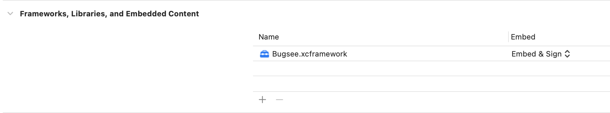

:::info[Agent-Assisted Setup]
Ask your AI coding assistant:

```text
Use curl to download, read and follow: https://docs.bugsee.com/ai/agent-skills/sdk/react-native/SKILL.md
```

Works with Claude Code, Cursor, Copilot, Codex, and more. [Learn more](/ai/agent-skills/)
:::

## Installation

### 1. Install

Installing the **react-native-bugsee** module allows for richer integration and brings the ability to further control Bugsee from within your JavaScript code.

Install the module itself:

```bash
npm install --save react-native-bugsee
```

### 2. Prepare iOS project

#### With CocoaPods

Execute the following commands in terminal to download and install required Pods:

```
cd ios
pod install
cd ..
```

#### Manual installation (without CocoaPods)

Download the latest version from [here](https://download.bugsee.com/sdk/ios/dynamic/Bugsee-stable.xcframework.zip) and extract it.
Copy ```Bugsee.xcframework``` to your project by drag and dropping it into the right location. When asked, choose to copy:



You can also use the instructions for native iOS applications from [here](/sdk/ios/installation/) to install the native part of the Bugsee SDK for React Native.

### 3. Prepare Android project

After installing the `react-native-bugsee` module, perform a Gradle Sync to fetch and set up the Bugsee SDK. No additional manual configuration is required for Android.


## Launch from JS

:::warning
iOS/iPadOS: Since v6.0.0 the underlying Bugsee iOS SDK supports the simulator; crash capture is excluded. For full functionality, launch your app with Bugsee on a real device.
:::

Now open your App.js and add the following code to launch Bugsee at application startup (don't forget to use the proper application tokens):

```javascript
import Bugsee from 'react-native-bugsee';
import {Platform} from 'react-native';

// ...

export default class App extends Component<{}> {
  constructor(props) {
    super(props);

    this.launchBugsee();
  }

  async launchBugsee() {
    let appToken;

    if (Platform.OS === 'ios') {
        appToken = '<IOS-APP-TOKEN>';
    } else {
        appToken = '<ANDROID-APP-TOKEN>';
    }

    await Bugsee.launch(appToken);
  }
}
```


## Launch from native

:::warning
iOS/iPadOS: Since v6.0.0 the underlying Bugsee iOS SDK supports the simulator; crash capture is excluded. For full functionality, launch your app with Bugsee on a real device.
:::

In most cases, launching Bugsee from JavaScript code should be sufficient. However, if you prefer to launch it from native code (e.g., to catch early crashes), then you should follow the corresponding instructions for [iOS](/sdk/ios/configuration/) and [Android](/sdk/android/configuration/).

When launching Bugsee from native code, you have to initialize JS layer yourself. You should do that by calling `Bugsee.initialize()`. Refer to the code snippet below for an example.

```javascript
import Bugsee from 'react-native-bugsee';
import {Platform} from 'react-native';

// ...

export default class App extends Component<{}> {
  constructor(props) {
    super(props);

    this.initApp();
  }

  async initApp() {
    // ...

    await Bugsee.initialize();

    // ...
  }
}
```