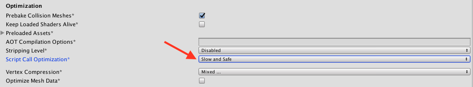
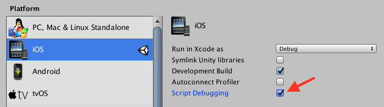

## Managed C# code crashes

In order for Bugsee to be able receive unhandled exceptions from managed C# code, the **Script Call Optimization** must be set to **Slow and Safe**.
Otherwise unhandled exceptions will result in app crashes with no useful information.

The setting can be found in Player Settings -> Other Settings -> Optimization:

Information about filenames and line numbers is available only when **Script Debugging** is enabled as well:

## Native crashes

Unity does not by default enables dSYM creation for its builds. Bugsee does not modify the build to enable it, it has to be done manually
on the resulting Xcode project. It will not work, however, if **Script Debugging** is enabled, dSYM generation fails in this case.

See iOS crash reporting [instructions](/sdk/ios/symbolication/) for information on setting dSYM auto uploading.

