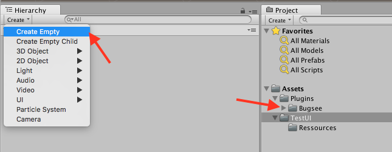
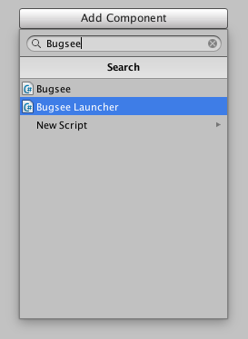
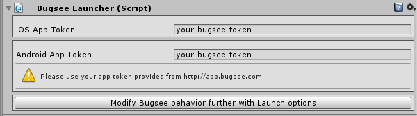

:::info Agent-Assisted Setup
Ask your AI coding assistant:

```text
Use curl to download, read and follow: https://docs.bugsee.com/ai/agent-skills/sdk/unity/SKILL.md
```

Works with Claude Code, Cursor, Copilot, Codex, and more. [Learn more](/ai/agent-skills/)
:::

## Plugin Installation

Download and install the latest [Bugsee.unitypackage](https://download.bugsee.com/sdk/unity/BugseeUnity-stable.unitypackage) (or see all available versions [here](/sdk/unity/versions/)) package and install it in your project. Note, that if an older version of Bugsee package was installed in your project, it is necessary to remove "Plugins\Bugsee" folder first.
This should install all the necessary files in the Assets folder of your project.

Make sure the files were indeed added to your project and create a new empty object within a scene:



Select the new object and add BugseeLauncher script component to it:



Once the component is added, you will be presented with the options screen, which contains Android and iOS apps token fields. If you compile your app for the single mobile platform, you can set only corresponding app token.



**IMPORTANT**: Starting from Android 9 and onwards, if you're using Bugsee VideoMode.V2, you also need to add ```FOREGROUND_SERVICE``` permission to your ```AndroidManifest.xml```, like shown below. Additionally, starting from Android 14, you also need to add  ```FOREGROUND_SERVICE_MEDIA_PROJECTION``` permission to your ```AndroidManifest.xml```. Otherwise, video capture will not work properly (or will not be working at all).
```xml
<uses-permission android:name="android.permission.FOREGROUND_SERVICE" />
<uses-permission android:name="android.permission.FOREGROUND_SERVICE_MEDIA_PROJECTION" />
```

### Gather GPU info on Android

Bugsee can collect additional information, such as GPU model and supported GL version. But it requires additional installation step, which consists in adding BugseeEventsListener script to MainCamera. You should select MainCamera, then click **Add component** button, select **Scripts->BugseePlugin->Bugsee Events Listener**. After this Bugsee will be able to listen for rendering events in order to retrieve GPU info from GL context. Currently GPU info is not retrieved, when **Multi-threaded rendering** Player setting is enabled.


## Manual launch

In cases when you want to launch Bugsee from code (e.g. upon some event or user action), you need to perform one additional step in your initialization code to make Bugsee function as designed.

Under the hood, Bugsee launcher adds an object to the scene named "bgs_gameObject". it is required to perform communication between managed code (.NET) and native backend (our platform SDK). When you call ```Bugsee.Launch()``` yourself, there will be no that special object added to the scene, hence you should do that yourself.

:::warning
"bgs_gameObject" GameObject is required to perform communication between managed code and our platform SDK. Please, do not remove or rename "bgs_gameObject".
:::

You can use an existing object for that, but we strongly encourage you to create a dedicated object to prevent any possible conflicts.

Once you've done with the object, in your code, before calling ```Bugsee.Launch()``` execute the following code:

```csharp
// gameObject below is the reference to the object in the scene
// that will be used an by Bugsee for its internal communication
// procedures

gameObject.AddComponent<Bugsee>();
```