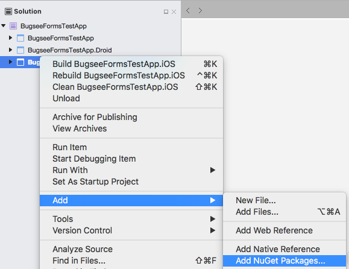
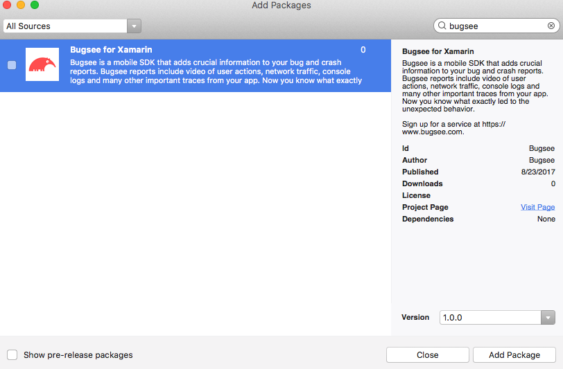

import Tabs from '@theme/Tabs';
import TabItem from '@theme/TabItem';

:::caution Deprecated
Microsoft ended support for Xamarin on May 1, 2024. The Bugsee Xamarin SDK is no longer actively maintained. For new projects, use the [Bugsee .NET SDK](/sdk/dotnet/installation/), which supports .NET MAUI and modern .NET workloads.
:::

:::info Agent-Assisted Setup
Ask your AI coding assistant:

```text
Use curl to download, read and follow: https://docs.bugsee.com/ai/agent-skills/sdk/xamarin/SKILL.md
```

Works with Claude Code, Cursor, Copilot, Codex, and more. [Learn more](/ai/agent-skills/)
:::

Xamarin plugin is currently supported on iOS, Android and Xamarin.Forms platforms. The recommended way to install Bugsee is using [NuGet](https://www.nuget.org).

## NuGet installation

**Note:** We've found NuGet package installation issues in some versions of Visual Studio where some of the DLLs are not referenced correctly. If you are facing similar issue, try updating Visual Studio to the latest version.

Open your solution, select the project you want to add Bugsee package to and open its context menu. Unfold "Add" and click "Add NuGet packages...".



Type "Bugsee" into search field, select Bugsee package and click "Add Package" button at the bottom right.



## Initialization

:::warning
iOS/iPadOS: Make sure you launch your app with Bugsee on a real device. Underlying Bugsee iOS SDK does not work in simulator as it heavily depends on the hardware.
:::

When possible, Bugsee provides unified API across platforms for accessing Bugsee features. Initialization, on the other hand,
has minor differences on iOS and Android platforms.


<Tabs groupId="platform">
  <TabItem value="ios" label="iOS">

```csharp
// Your AppDelegate.cs file

using BugseePlugin;

namespace YourNameSpace
{
	[Register("AppDelegate")]
	public partial class AppDelegate : UIApplicationDelegate
	{
		public override bool FinishedLaunching(UIApplication application, NSDictionary launchOptions)
		{
			Bugsee.Launch("<your token>");
			return base.FinishedLaunching(application, launchOptions);
		}
	}
}
```

  </TabItem>
  <TabItem value="android" label="Android">

```csharp
// Your Application.cs file - a subclassed Application

using BugseePlugin;

namespace YourNameSpace
{
	[Application]
	public class MyApplication : Application
	{ 	
		public MyApplication(IntPtr handle, JniHandleOwnership ownerShip) : base(handle, ownerShip) {}

		public override void OnCreate()
		{
			base.OnCreate();

			Bugsee.Launch("<your token>");
		}
	}
}
```

  </TabItem>
</Tabs>

## Using with Xamarin.Forms

If your application is based on Xamarin.Forms, you may want to manipulate Bugsee from your shared project. Starting with version 2.0.0 you can do it following these steps:

- Add Bugsee NuGet package to your Android, iOS and shared projects
- Using ```DependencyService```, register Bugsee singleton before launching it, like shown below

```csharp
using BugseePlugin;

// ...

public void LaunchBugsee()
{
	// register Bugsee as singleton with DependencyService
	Xamarin.Forms.DependencyService.RegisterSingleton<IBugsee>(Bugsee.GetInstance());

	Bugsee.Launch("<your token>");
}
```

- Finally, in your shared project get ```Bugsee``` instance from ```DependencyService``` and use it as required. You can do it like this:

```csharp
var bugsee = Xamarin.Forms.DependencyService.Get<BugseePlugin.IBugsee>();
if (bugsee != null)
{
	// perform any required manipulations
}
```