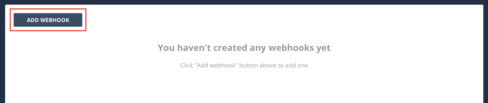
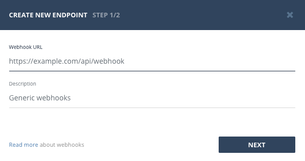
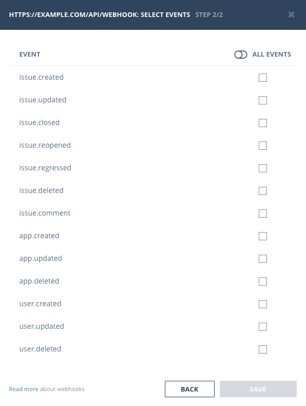
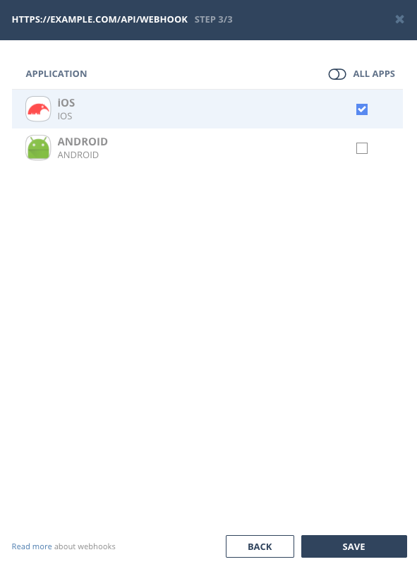
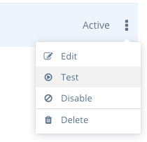
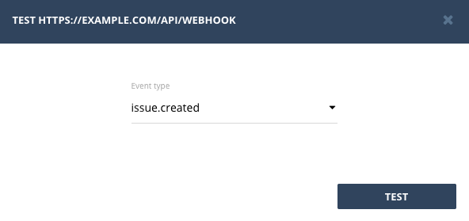
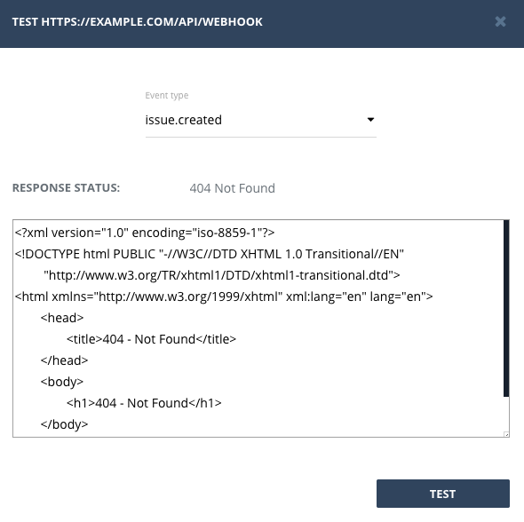

## Add new Webhook

Webhooks can be managed in special [Webhooks](https://app.bugsee.com/#/settings/org/webhooks/) page in web dashboard. To create a new webhook, click "Add webhook" button at the top.

That will bring up a new webhook wizard. One the first step fill in the remote URL to your server and optionally provide some description.

On the next step, check events you want to receive notifications about to the specified URL (they will be sent as POST requests).

If you have selected any of _issue.\*_ events on the second step, you will be presented with the third one, where you can select applications you want these events to be triggered for (all unchecked applications will not triggering events).

Finally click "Save" to save the configured Webhook.

## Test Webhook

After you've created a Webhook you can test it to make sure your servers handle Bugsee requests correctly. To test a Webhook, go to [Webhooks](https://app.bugsee.com/#/settings/org/webhooks) list, open menu for an item and click "Test"

That will bring the "Test webhook" dialog where you can select an event you want to test, and make Bugsee send a test request to your servers.

After you click test, we will issue a test request to your servers and display their response right in the test window

